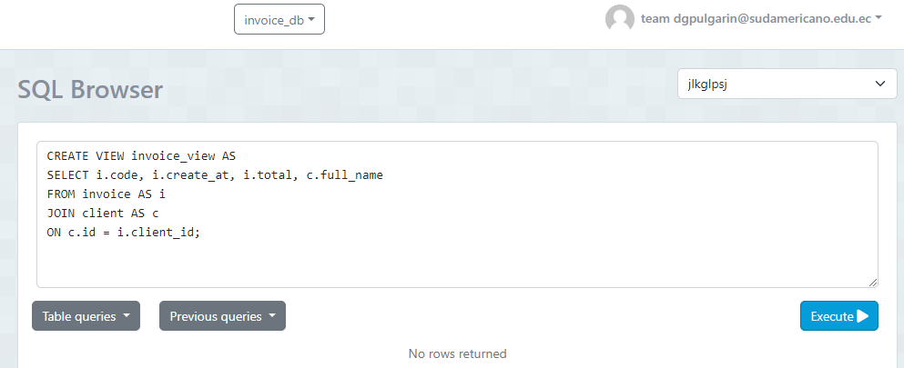
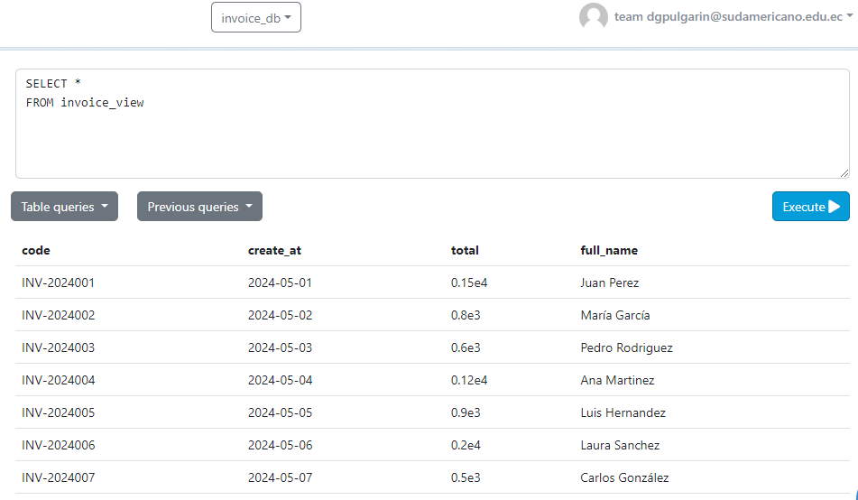

# Sentencias SQL y Capturas

## 1. Crear view invoice_view:
### Sentencia
CREATE VIEW invoice_view AS
SELECT i.code, i.crate_at, i.total, c.full_name
FROM invoice AS i
JOIN client AS c
ON c.id = i.client_id;

## 2. Seleccionar view:
### Sentencia
SELECT COUNT(*) 
FROM Client 
WHERE city = 'Cuenca';

## 3. Crea view detail_view:
### Sentencia
CREATE VIEW detail_view AS
SELECT d.quantity, p.description, d.price, d.subtotal
FROM detail AS d
JOIN product AS p
ON p.id = d.product_id;

## 4. Seleccionar view:
### Sentencia
SELECT * 
FROM detail_view

